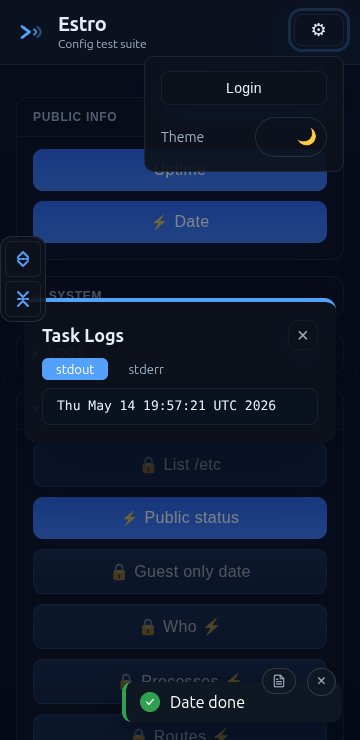

#  Estro

A minimal web UI for running shell commands from the browser — local or over SSH.

Most of this so-called documentation is example driven, so it is.

<details><summary>Ugly light theme demo</summary>
<p></p>


</details>

<details><summary>Dark theme demo</summary>
<p></p>


</details>

<details><summary>Mobile demo</summary>
<p></p>


</details>

<details><summary>Why this tool name?</summary>
<p></p>

Because:
- I hate English. Have to use it on a daily basis, grand.
- I love Esperanto. Only know about 5 words in it, mind you.
</details>

## Run

<details><summary>Docker</summary>
<p></p>

Get [`compose.yaml`](compose.yaml) file, modify, and:

```sh
docker compose up -d
```
</details>

<details><summary>Go</summary>
<p></p>

```sh
go build -o estro ./cmd/estro
./estro -config config.yaml
```

Or run directly:

```sh
go run ./cmd/estro -config config.yaml
```

The `-config` flag can also be set via the `ESTRO_CONFIG` environment variable.

Optionally download a fresh binary from GitHub releases.
</details>

## Configuration

All configuration lives in a single `config.yaml` file. See demo [`config.yaml`](./config.yaml) for reference.

To generate a user password hash:
```sh
docker run --rm httpd htpasswd -bnBC 10 "" YOUR_PASS | tr -d ':\n'; echo
```

## Security

**Estro is designed for trusted home networks only. Do not be eejit — don't expose it to the internet.**

- Sessions use `httpOnly`, `sameSite=strict` cookies — not that it makes a scrap of difference if you're daft enough to put this on the open web
- Passwords are stored as bcrypt hashes (cost 10), so at least they'll be grand if everything else goes sideways
- Login attempts are rate-limited to 10 per 15 minutes per IP — might slow a determined soul down for a minute or two
- `StrictHostKeyChecking=no` means SSH connections are vulnerable to MITM on untrusted networks — only use on LANs you control

In fairness, it's just a tiny pet project for the home lab — ~0 stability and no grand plan beyond scratching me own itch.

### Persistent session secret

If no `secret` is set in `config.yaml`, a random secret is generated on every restart, invalidating all existing sessions. Set a stable secret for persistent logins:

```yaml
global:
  secret: your-random-secret-here
```

## Development

```sh
go run ./cmd/estro -config config.yaml          # run with auto-recompile
go test -race ./...                             # run tests
go test -race -coverprofile=coverage.out ./...  # tests with coverage
```

## How to support me

Feel free to support me by giving away all your money... or by pouring a pint for my LLM context at the nearest pub. Sure wouldn't say no.
